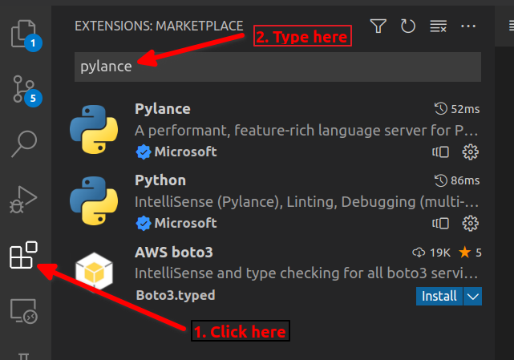

Modules and Packages
====================

In this tutorial we will start to use vscode to develop a Python package 
for making buildings in the game. We will be starting with 
the pagoda building from the previous tutorial and here we will also 
go into the detail of how the pagoda function works.

Preparing VSCode
----------------

VSCode has some great extensions for working with Python files. Let's make sure 
those are installed now. 

Click on the extensions Icon and type ``pylance``. Click on ``install`` for 
the two Microsoft extensions listed.

   Adding Extensions

Getting a Bash Prompt
---------------------

We are going to use some bash (zsh) commands here so lets open a second terminal
in VSCode so that we can have a bash prompt but also keep our Python shell
prompt open.

Right click in the VSCode terminal area and select ``Split Terminal``

.. figure:: ../images/split_term.png
   :alt: split_terminal
   :align: center
   :width: 600px

   Splitting the Terminal

You can grab the dividing line between the two terminals and drag it to the
right with your mouse. This makes the Python terminal bigger and the 
Bash terminal smaller. Then your terminal area of VSCode should look like 
this:

.. figure:: ../images/terminals.png
   :alt: split_terminal
   :align: center
   :width: 900px

   Python prompt and Bash prompt

Create a Package and a Module
-----------------------------

A python module is simply a file with a ``.py`` extension containing Python
code.

A package is simply a folder (directory) that contains python modules.

We are going to create a package called ``buildings`` with a single module
to start with called ``pagoda``. Type the following commands at the
bash prompt::

    cd $HOME/my_world
    mkdir buildings
    cd buildings
    touch __init__.py
    code pagoda.py

The steps above were:

- Change working directory to ``$HOME/my_world`` which is our VSCode work folder.
- Make a new directory called ``buildings``, this is our new package
- Create an empty file called ``__init__.py`` in the ``buildings`` directory. 
  This is a special file name that tells Python that this directory is a 
  Python package.
- Tell vscode to open a new file called ``pagoda.py`` in the editor window

Now we can paste our pagoda function into the editor window and save it with
Menu -> File -> Save (or Ctrl+S is a shortcut to save the current file).
Use this slightly modified version of the pagoda function:

.. literalinclude :: ../../src/demo/pagoda2.py
   :language: python

To try using this function you can now type the following command in the
iPython prompt:

.. code-block:: python

    from buildings.pagoda import build_pagoda
    build_pagoda(world.player.pos)

That should build a little pagoda around your player. You can break some 
blocks to make a door for you to exit the pagoda.

How it Works
------------

Let's take a look at all of the new things that we used in our ``build_pagoda``
function.

import
~~~~~~

.. code-block:: python
   
   from mcwb.api import polygon

import allows us to access code from other modules. The polygon function is
implemented in a module called ``api`` in a package called ``mcwb``. 
We will frequently use code from two packages called ``mcwb`` (Minecraft world
builder) and ``mcipc`` (Minecraft inter-process communication). These are two
packages that ``mciwb`` is built on top of.

One of the greatest features of Python is its extensive library of built in
modules. For example the maths module contains functions for doing math.
e.g.

.. code-block:: python

    from math import sqrt, cos, sin

The polygon function itself is implemented using some of these math functions.
Luckily, you don't need to know anything about the mathematics of polygon
construction because the polygon function has done all that for you!

.. code-block:: python
   
   from mciwb import Direction, Item, get_client

The 2nd import function is importing things from ``mciwb``. ``mciwb`` is 
the package that contains the Minecraft world builder. We have already 
been using functions and variables defined in this package.

So, Direction and
Item are already familiar, we have previously used them in iPython without
needing to import them.
But we need to import them here because we are 
writing a new module called ``pagoda``. import is the command to share 
code between modules and is therefore required in our new ``pagoda`` module.

Once you become familiar with Python you will eventually be comfortable 
looking at online documentation to discover packages and modules you want to
use and discovering the imports you need to use them. But for now it is 
easiest just to copy the import statements from examples like ``pagoda.py``.

get_client
~~~~~~~~~~

Whenever we call any functions in the ``mciwb`` or ``mcipc`` packages we need
a client object. This represents a connection to our Minecraft server. 

The get_client function obtains a client object for you to use. Here we 
assign it into the variable ``c`` and pass ``c`` to the polygon function.

Advanced programmers may want to read up on how this is a thread-safe
client object, see (`mcipc`).

comments
~~~~~~~~

At the beginning of ``build_pagoda`` we have a block comment. It uses the 
triple quotes ``"""`` which allow you to write a block of text that is not
interpreted as Python code.

Good programmers will usually add a comment block at the top of their
functions and using triple quotes is the standard way to do this.

extra parameters to ``range``
~~~~~~~~~~~~~~~~~~~~~~~~~~~~~

We already learned that for example ``range(10)`` is a list of numbers from
0 to 9. But here we have:

.. code-block:: python
   
    for floor_width in range(width, 2, -2)

When you provide these 3 parameters to range they are interpreted as 
start, stop and step. So here we start at the width of the pagoda base as
provided by the caller and then we go down to 2 in steps of -2.

i.e. if we pass width=30 then the for loop will execute once for each of 
these values of floor_width:

    30, 28, 26, 24, 22, 20, 18, 16, 14, 12, 10, 8, 6, 4, 2
    
mcwb.polygon
~~~~~~~~~~~~

polygon is a function implemented in the mcwb package. It is capable of 
making any regular polygon and using that shape to build a tower (or a tunnel!).
If you want to make a circular tower then you can just pass a large number 
like 400 as the number of sides.

Making a Pagoda
~~~~~~~~~~~~~~~

So how does the overall function work?

We see that we have a for loop that iterates over the range of ``floor_widths``.
These ``floor_widths`` start at the ``width`` you passed (30 in the example I gave)
and step down in size by 2 blocks until we reach 2 blocks.

For each iteration of the ``for loop`` we build some walls and a balcony.

The ``base`` of the walls is calculated as ``level`` * ``floor_height`` blocks 
above the starting ``pos``. As ``floor_height`` is 4 by default, the first 
floor ``base`` is 0 blocks above the starting ``pos`` and each successive 
``level`` is 4 blocks above the previous ``level``. 

We start by setting ``level`` to zero and the following statement:

.. code-block:: python
   
    level += 1

causes level to have one added to itself. So it gets one bigger, each time 
through the ``for loop``.

To create the walls we call polygon with these parameters::

    c: the client object needed to talk to the Minecraft server
    base: the calculate starting point for the polygon
    floor_height: the height of the polygon (defaults to 4)
    sides: the number of sides of the polygon, we use 4, making a square
    item: the blocks to use for the polygon, defaulted to GOLD_BLOCK

As we loop around the ``for loop`` we create a new polygon at each level,
but the width of it is shrinking by two blocks at each level. Eventually
we get to a narrow level of 2 blocks at the top and the loop completes.

exercise:
    can you work out how the balcony is being drawn on each level? look
    at the math used to calculate ``balcony`` and the ``polygon`` function
    parameters used to draw the balcony and see if you can figure out how
    it works.

